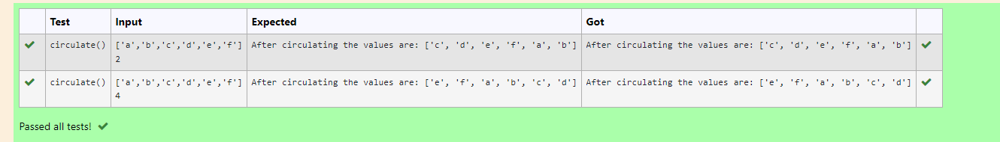

# Circulate-the-values-of-N-variables
## Aim:
To write a python program to circulate the n variables using function concept
## Equipment’s required:
PC
Anaconda - Python 3.7
## Algorithm: 
### Step 1: 
Get the value form the user for rotation.
### Step 2: 
Get the value from the user for the number of rotation
### Step 3:  
Using the slicing concept rotate the list 
## Program:
```
#Program to circulate N values.
#Developed by: Kavinesh M
#RegisterNumber:22008476
def circulate():
    n=eval(input())
    a=int(input())
    d=n[a:]+n[:a]
    print('After circulating the values are:',d)
```
## Output:


## Result:
Thus the program is developed for circulate the n variables.